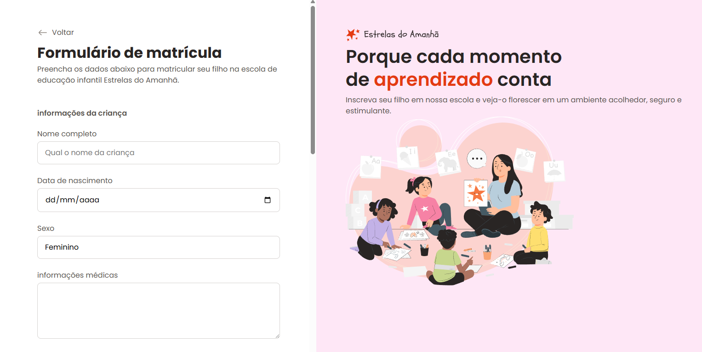

<<<<<<< HEAD
#Projeto RockeatSeat!

##Tecnologias Utilizadas  💻:
=======
## Projeto RockeatSeat!

## Tecnologias Utilizadas  💻:
>>>>>>> 35fd9f4f3e2a07edc20769f761040032d52c33df

- HTML e CSS
- Figma
- Git e GitHub

<<<<<<< HEAD
O projeto é um **formulário** para os pais ou resposáveis, para ingressar o seu filho em uma escola. 
=======
O projeto é um **formulário** para os pais ou resposáveis, para ingressar o seu filho em uma escola. Possui inputs e botões modernos, com efeitos de hover e foco, layout organizado e adaptação automática para celulares e computadores. Inclui campos básicos como nome, email, senha e mensagem, usando bordas arredondadas, espaçamentos adequados e um design limpo, sem qualquer uso de JavaScript.
>>>>>>> 35fd9f4f3e2a07edc20769f761040032d52c33df

### 🖼️ Imagens do Projeto:

<<<<<<< HEAD
=======

>>>>>>> 35fd9f4f3e2a07edc20769f761040032d52c33df

